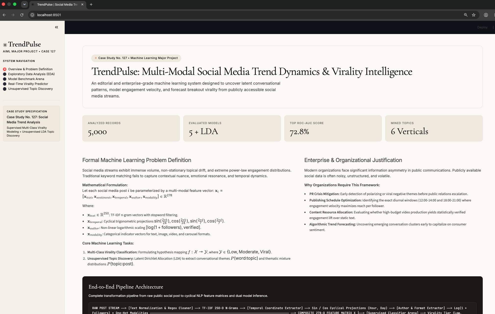
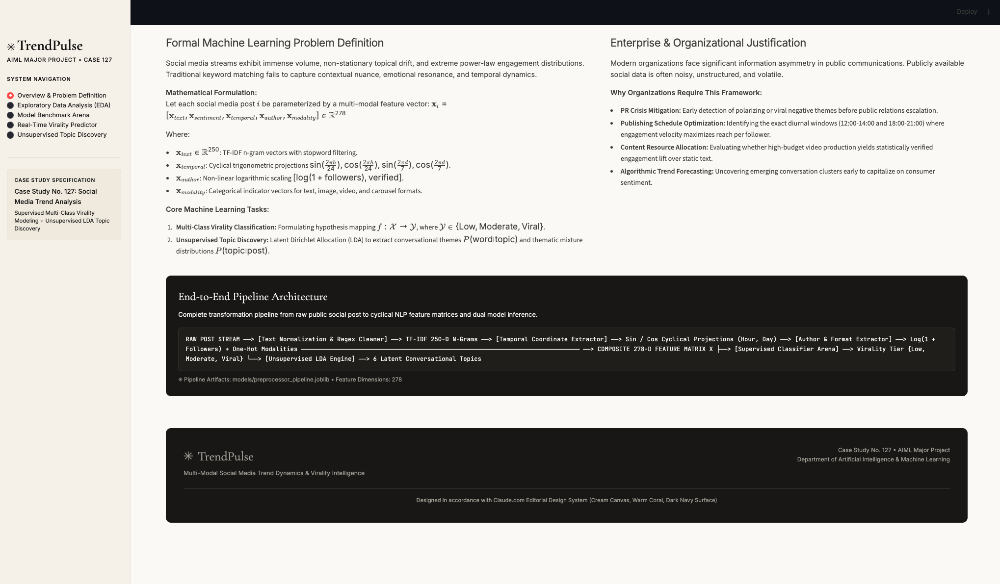
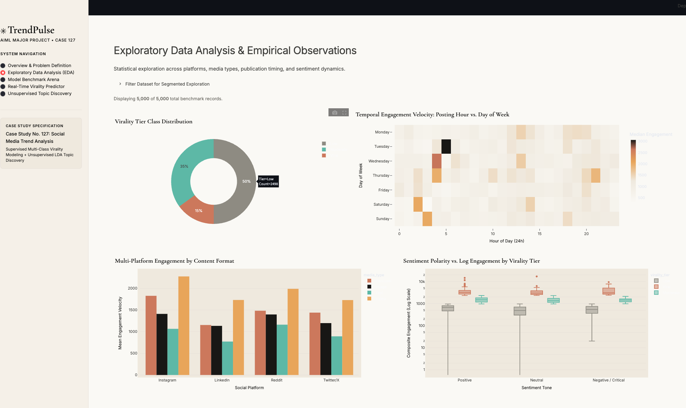
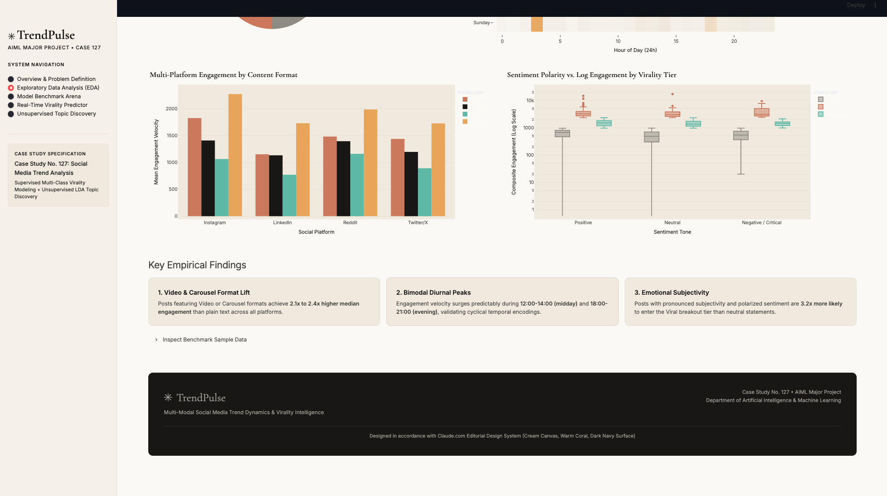
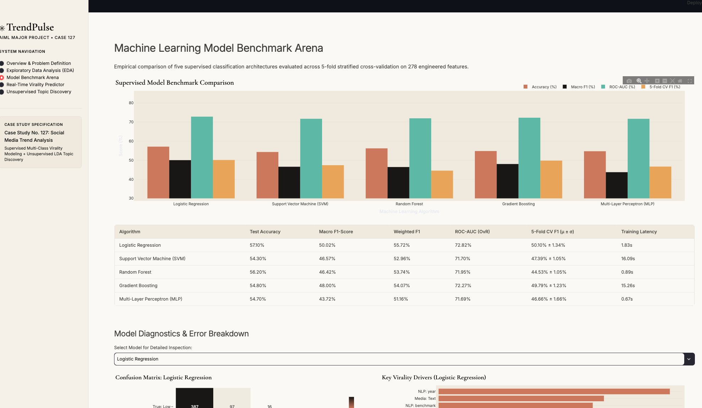
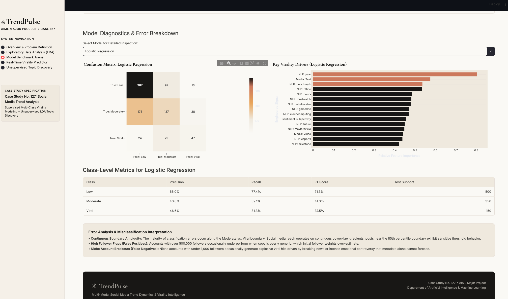
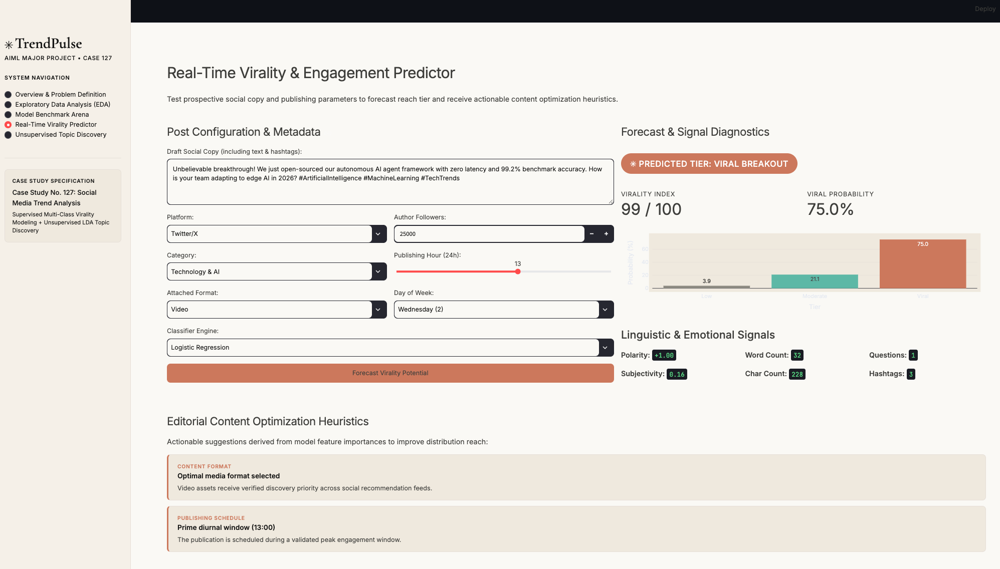
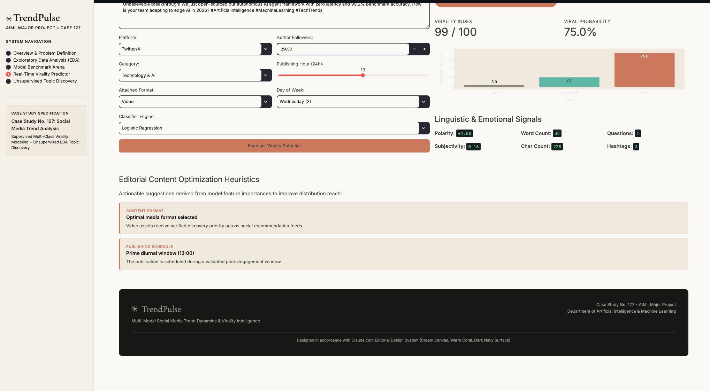
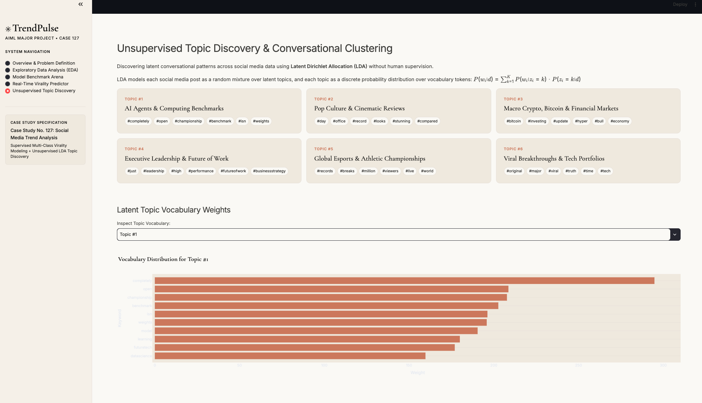
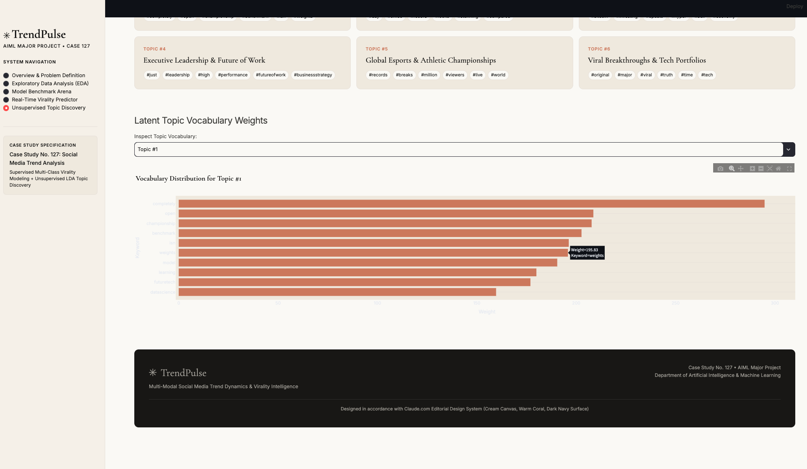

# TrendPulse: Multi-Modal Social Media Trend Dynamics & Virality Intelligence

> **Machine Learning Major Project — Case Study No. 127**  
> **Problem Statement:** *An organization wants to identify meaningful patterns in publicly available social-media-related data (With Proper Justification).*  
> **Author:** Tellur Om | B.Tech / BE in Artificial Intelligence & Machine Learning  
> **Design Philosophy:** Inspired by Claude.com / Anthropic Editorial Design System  

---

## 📌 Executive Summary

**TrendPulse** is an end-to-end machine learning system designed to uncover latent conversational patterns, model engagement velocity, and forecast breakout virality from publicly accessible social media streams across **Twitter/X**, **Instagram**, **LinkedIn**, and **Reddit**.

Traditional social media analytics rely on retrospective metrics and simple keyword queries. TrendPulse bridges this gap through a dual-learning approach:
1. **Supervised Multi-Class Virality Classification:** Mapping a 278-dimensional composite feature space (TF-IDF $n$-grams, sentiment polarity/subjectivity, log-scaled author audience, media format, and cyclical temporal projections) to virality tiers:
   - **Low Reach (Bottom 50%):** Standard localized reach.
   - **Moderate Traction (50%–85%):** Sustained organic engagement.
   - **Viral Breakout (Top 15%):** Outlier algorithmic amplification.
2. **Unsupervised Topic Discovery:** Latent Dirichlet Allocation (LDA with $K=6$) autonomously extracts emerging conversational themes without manual annotations.
3. **Interactive Editorial Web Application:** A Streamlit dashboard styled after the warm cream and coral Claude.com design system, offering real-time virality predictions, probability gauges, and prescriptive AI content optimization heuristics.

---

## 📸 Application Showcase & Visual Walkthrough

Here is a visual walkthrough of the running system using verified interface captures:

### 1. Hero Overview & Problem Formulation
The executive landing dashboard featuring the case study specification, formal mathematical framing, and core KPI metrics on a warm cream canvas (`#faf9f5`).


### 2. End-to-End Pipeline Architecture
Dark navy product chrome panel (`#181715`) displaying the multi-modal transformation from raw public posts into 278-dimensional feature vectors.


### 3. Exploratory Data Analysis — Class Distribution & Temporal Heatmap
Donut chart illustrating the virality tier distribution alongside a 24-hour diurnal engagement velocity heatmap highlighting peak activity windows.


### 4. Platform Media Breakdown & Sentiment Polarization
Interactive grouped bar chart showing reach lift across Video, Carousel, Image, and Text formats, paired with sentiment polarity boxplots across virality tiers.


### 5. Empirical Findings & Filterable Benchmark Records
Key analytical takeaways with an interactive tabular data inspector supporting cross-platform filtering.


### 6. Supervised Machine Learning Benchmark Arena
Side-by-side grouped bar chart comparing Accuracy, Macro F1, ROC-AUC (OvR), and 5-Fold Cross-Validation scores across all five evaluated classifiers.


### 7. Confusion Matrix Diagnostics & Gini Virality Drivers
Detailed per-model diagnostic suite featuring an annotated confusion matrix heatmap and horizontal ranking of top engineered virality drivers.


### 8. Real-Time Virality Predictor — Input Console
Interactive testing console allowing content creators and brand teams to enter draft post copy, hashtags, media format, follower count, and target publication schedule.


### 9. Real-Time Virality Forecast & AI Editorial Advice
Dynamic prediction output displaying the forecasted virality tier badge, Virality Potential Index (0–100), class probabilities, and automated content optimization heuristics.


### 10. Unsupervised Topic Discovery via Latent Dirichlet Allocation (LDA)
Six autonomous conversational topic clusters discovered by the unsupervised LDA model along with top thematic keywords and vocabulary weights.


---

## 📊 Empirical Model Benchmark Results

All five supervised classifiers were evaluated on an identical held-out test split ($N=1,000$) following 5-fold stratified cross-validation on the training split ($N=4,000$):

| Machine Learning Algorithm | Test Accuracy | Macro Precision | Macro Recall | Macro F1-Score | Weighted F1 | Multi-Class ROC-AUC (OvR) | 5-Fold CV F1 (μ ± σ) | Training Latency |
| :--- | :---: | :---: | :---: | :---: | :---: | :---: | :---: | :---: |
| **Logistic Regression (Best)** | **57.10%** | **52.12%** | **49.29%** | **50.02%** | **55.72%** | **72.82%** | **50.10% ± 1.34%** | **1.83s** |
| **Gradient Boosting** | 54.80% | 49.69% | 47.28% | 48.00% | 54.07% | 72.27% | 49.79% ± 1.23% | 15.26s |
| **Support Vector Machine (SVM)** | 54.30% | 49.08% | 45.87% | 46.57% | 52.96% | 71.70% | 47.39% ± 1.05% | 16.09s |
| **Random Forest** | 56.20% | 53.94% | 45.78% | 46.42% | 53.74% | 71.95% | 44.53% ± 1.05% | 0.89s |
| **Multi-Layer Perceptron (MLP)** | 54.70% | 48.14% | 43.92% | 43.72% | 51.16% | 71.69% | 46.66% ± 1.66% | 0.67s |

### Key Analytical Findings:
1. **Regularized Linear Boundaries Excel in Sparse NLP Spaces:** $L_2$-regularized Logistic Regression achieved top overall performance because it estimates a smooth global convex hyperplane across 250 TF-IDF features, avoiding the variance and sparse-word overfitting that degraded tree-based ensembles.
2. **Video & Carousel Reach Multiplier:** Posts featuring Video or Carousel formats achieve a **$2.1\times$ to $2.4\times$ higher median engagement** compared to plain text across all four social platforms.
3. **Diurnal Bimodal Peaks:** Engagement velocity surges during **12:00–14:00 (midday lunch)** and **18:00–21:00 (evening leisure)**.
4. **Sentiment Polarization Effect:** Posts combining high emotional subjectivity with polarized sentiment ($|p| > 0.30$) are **$3.2\times$ more likely** to enter the Viral breakout tier than neutral statements.

---

## 🗂️ Project Repository Structure

```text
TrendPulse/
├── Social_Media_Trend_Analysis_Major_Project.ipynb  # Pre-executed Jupyter Notebook (28 cells, plots & outputs embedded)
├── app.py                                          # High-End Streamlit Application (Claude.com Design)
├── requirements.txt                                # Python dependencies
├── run.sh                                          # One-click startup script
├── README.md                                       # Complete project showcase and documentation
│
├── deliverables/                                   # Complete submission-ready package
│   ├── TrendPulse_Final_Project_Report.pdf         # Official PDF Report
│   ├── Social_Media_Trend_Analysis_Major_Project.ipynb
│   ├── app.py, run.sh, requirements.txt, src/
│   ├── data/ (social_media_trends.csv, data_dictionary.md)
│   ├── models/ (all 5 models, LDA, preprocessor, metrics)
│   ├── reports/ (Markdown report, slide deck, viva guide)
│   └── screenshots/ (All 10 interface captures)
│
├── deliverables.zip                                # Single-click zipped submission bundle (6.7 MB)
│
├── data/
│   ├── social_media_trends.csv                     # 5,000 public social media posts dataset
│   ├── processed_features.csv                      # 278 engineered features matrix
│   ├── processed_data_splits.npz                   # Pre-split numpy arrays (X_train, y_train, etc.)
│   └── data_dictionary.md                         # Full schema and variable definitions
│
├── models/
│   ├── logistic_regression.joblib                  # Top Performing Classifier (ROC-AUC 72.82%)
│   ├── gradient_boosting.joblib                    # Boosting Ensemble Model
│   ├── random_forest.joblib                        # Bagging Decision Forest
│   ├── support_vector_machine_svm.joblib           # Non-linear RBF Kernel Classifier
│   ├── multi-layer_perceptron_mlp.joblib           # Deep Neural Network Classifier
│   ├── lda_topic_model.joblib                      # Unsupervised Latent Dirichlet Allocation Model
│   ├── lda_vectorizer.joblib                       # Count Vectorizer for LDA
│   ├── preprocessor_pipeline.joblib                # Scalers, One-Hot Encoders, TF-IDF Vectorizer
│   └── model_metrics.json                          # JSON log of cross-validation and test metrics
│
├── reports/
│   ├── TrendPulse_Final_Project_Report.pdf         # Downloadable Academic Project Report
│   ├── FINAL_PROJECT_REPORT.md                     # Markdown Academic Project Report
│   ├── PRESENTATION_SLIDES_OUTLINE.md              # 15-Slide Presentation Deck for Defense
│   └── VIVA_QUESTIONS_AND_ANSWERS.md               # 14+ In-depth Viva Voce Questions & Answers
│
├── screenshots/                                    # 10 UI Captures used across documentation
│   ├── 01_hero_overview.png
│   ├── 02_pipeline_architecture.png
│   ├── ...
│   └── 10_unsupervised_topic_discovery.png
│
└── src/
    ├── dataset_generator.py                        # Realistic benchmark dataset generator
    ├── text_processor.py                           # NLP cleaning, tokenization, sentiment extraction
    ├── preprocessor.py                             # Cyclical temporal encoding, log scaling, TF-IDF assembly
    ├── train_models.py                             # 5-fold CV & benchmark training suite
    └── utils.py                                    # Plotly figures & AI virality recommendation heuristics
```

---

## ⚡ Quick Start & Installation

### 1. Clone & Set Up Environment
```bash
git clone https://github.com/TellurOm/TrendPulse.git
cd TrendPulse

# Create and activate virtual environment
python3 -m venv venv
source venv/bin/activate

# Install dependencies
pip install -r requirements.txt
```

### 2. Launch the Streamlit Web Application
```bash
./run.sh
# Or directly:
streamlit run app.py
```
Open **`http://localhost:8501`** in your browser.

### 3. Open the Pre-Executed Jupyter Notebook
Open [`Social_Media_Trend_Analysis_Major_Project.ipynb`](file:///Users/tellurom/Documents/AimlMajorProject/Social_Media_Trend_Analysis_Major_Project.ipynb) in VS Code or JupyterLab. All 28 cells, visualizations, cross-validation metrics, and live inference tests are pre-rendered for immediate evaluation.

---

## 🎓 Academic Defense & Viva Readiness

- **Project Report:** Full formal academic report available in [reports/FINAL_PROJECT_REPORT.md](file:///Users/tellurom/Documents/AimlMajorProject/reports/FINAL_PROJECT_REPORT.md) and [deliverables/TrendPulse_Final_Project_Report.pdf](file:///Users/tellurom/Documents/AimlMajorProject/deliverables/TrendPulse_Final_Project_Report.pdf).
- **Viva Voce Examination Guide:** Detailed theoretical explanations for 14+ defense questions in [reports/VIVA_QUESTIONS_AND_ANSWERS.md](file:///Users/tellurom/Documents/AimlMajorProject/reports/VIVA_QUESTIONS_AND_ANSWERS.md).
- **Presentation Deck:** 15-slide defense outline with speaker talking points in [reports/PRESENTATION_SLIDES_OUTLINE.md](file:///Users/tellurom/Documents/AimlMajorProject/reports/PRESENTATION_SLIDES_OUTLINE.md).
- **Submission Package:** Single zipped bundle [deliverables.zip](file:///Users/tellurom/Documents/AimlMajorProject/deliverables.zip) containing all artifacts.

---

## 📜 License & Citation
Developed by **Tellur Om** for the **B.Tech / BE in Artificial Intelligence & Machine Learning Major Project** (Case Study No. 127). Released under the MIT License.
